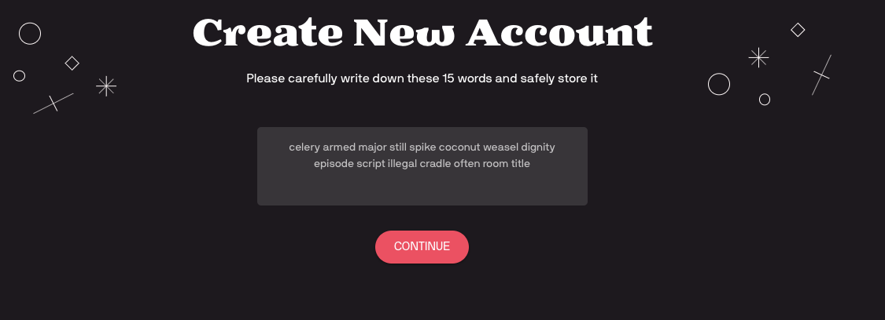
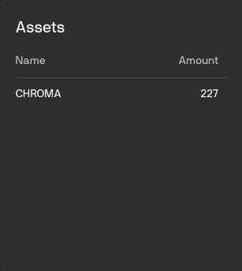

===============
Chromia Vault
===============

Short Overview
--------------

Chromia Vault is a wallet in nature that supports asset transfers within the Chromia ecosystem. It can be used to transfer any kind of :doc:`FT3 </advanced-topics/ft3>` assets (Chromia equivalent of Ethereum ERC-20 and ERC-721 protocols).

However, besides just transfers, Vault has additional features like dapp account linking and browsing Chromia dapps. Dapp account linking feature allows you to Single Sign-On (SSO) into your dapp account using the Vault (same way Google or Facebook login can be used to login into different websites), and to control your dapp account assets directly from the Vault.

This section describe how an end user can perform such actions on the `Chromia Vault webapp <https://vault-testnet.chromia.com/>`_.

Accessing the Vault
-------------------

Creating new account
~~~~~~~~~~~~~~~~~~~~

Account creation is a 3-steps process.

|Create An Account Step 1|

1. First, user will have to choose the account name along with a password for it. The name and password are not public, and will only be used for accessing the account later on.

|Create An Account Step 2|

2. After account name and password fields are filled, by clicking “Continue” user will be taken to the new screen showing 15 words (the **mnemonic**).

   It is highly advised to print out or write down these words and store them in a safe place.

.. important::

  Knowing these 15 words in correct order is the only way to retrieve the account if the password has been lost or the browser history is cleared for any reason.

|Create An Account Step 3|

3. After user has safely stored the words, clicking “Continue” will take user to a screen where they will have to click (or drag&drop) the words in the correct order and thus “confirm” that they has stored the words somewhere.

|Create An Account Step 4|

When all words are laid down in the correct order will the "Confirm" button be enabled.

By clicking “Confirm”, the account will be stored to local browser storage and user will be taken to the Dashboard screen.

Accessing the account (Login)
~~~~~~~~~~~~~~~~~~~~~~~~~~~~~

All created accounts will be stored to local browser storage (on the device). Accounts are unlocked by a password that was chosen while creating an account.

|Access An Account|

If the user wants to access an existing account on a device, they can use the “Import Existing Account”:

Importing existing account
~~~~~~~~~~~~~~~~~~~~~~~~~~

Import existing account feature is used when you are trying to access your account on other devices, or when you have forgotten your password so can’t login normally.

Importing account is a 2-steps process.

|Import An Account Step 1|

1. First user will be asked to provide the 15 words mnemonic from when they created that account in correct order.

|Import An Account Step 2|

2. On the next screen user will be asked to provide a name for the account and choose the password for it, which will be used to access the account on that device from now on.

Dashboard
---------
The Dashboard page is separated into 3 different sections: Chromia Accounts, Linked Apps and Explore Apps.

Chromia accounts
~~~~~~~~~~~~~~~~

|Chromia Accounts|

Chromia Accounts are something that we usually call “main chain” accounts. There could be multiple Chromia Accounts within one Vault Account. Gaining access to a Vault Account will allow access to all Chromia Accounts beneath it.

Explore Apps
~~~~~~~~~~~~

|Explore Apps|

Explore Apps section is basically app explorer (Google play / App store equivalent) where one can browse and explore all the apps built in chromia ecosystem.

Linked Apps
~~~~~~~~~~~

|Linked Apps|

Linked Apps section contains all the apps that user has created an account for, which this Vault Account has control over.

Each dapp in Chromia ecosystem has its own blockchain. Every account (that little “Tile”) on the dashboard represents a combination of blockchain and specific account on that particular blockchain. These "Tile" are composed of 2 parts:

- Automatically generated squared image created from Blockchain ID, and
- Automatically generated robo-icon created from the Account ID.

That means if you have multiple accounts on the same Blockchain, they will have the same squared image, while robo-icon will be the same for the one accountId on different dapps.

Clicking on any of the accounts in the dashboard is taking to the “wallet” functionality of the Vault, used to send/receive assets from/to that specific account.

Asset Transfer (Wallet features)
--------------------------------

In order to access the wallet section, one needs to select the account from the dashboard first:

|Asset Transfer|

Assets
~~~~~~

|Asset Transfer - Assets|

Assets section is showing the list of all the available assets in that specific Account.

Sending assets
~~~~~~~~~~~~~~

|Asset Transfer - Send|

Assets are sent from the “Send Tokens” tab of the transfer section.

You can either enter the address manually (copy/paste) or use a QR scanner to scan the QR code containing recipient address info. The address is composed of 2 parts - blockchain id and account id, separated by the semicolon. So, address format is <blockhainId;accountId>.

Once address field is populated, “Application” and “Account” will be filled with appropriate hash icons automatically generated from the input address.

After address is populated, select an appropriate Asset and Amount to send, and click "Send".

Receiving assets
~~~~~~~~~~~~~~~~

|Asset Transfer - Receive|

On the “Receive Tokens” tab of transfer section, the address for this specific account is shown.

There is also a QR code shown next to the address. Instead of providing the address itself, it’s possible to provide QR code which someone can scan and send assets.

Furthermore, besides holding just address info, QR code can also hold “Amount” and “Asset” information. Whenever “Amount” or “Asset” fields are changed, QR code is being updated.

When such a QR code (containing asset or amount info) is scanned from the “Send Tokens” tab, those fields will be auto-populated on the UI as well.

Transaction history
~~~~~~~~~~~~~~~~~~~

|Asset Transfer - History|

Transaction history is a table showing account’s transactional activities.

It contains info about transaction type (sending or receiving), the account to which we have sent or from which we have received the assets (sender/recipient), along with some other information like which Assets were transferred, the amount, timestamp, etc.

SSO and app linking
-------------------

Chromia Vault offers Single Sign-On (SSO) service for the dapps in Chromia ecosystem. This allows users to login to different systems (apps) using single account. In order to take advantage of it, the application needs to integrate with Chromia Vault SSO service. Similarly to “Login with Facebook” or “Login with Google” features, once Chromia Vault has been used for SSO, user will have to authorize the app in the system. That looks like on the image below:

|SSO|

.. |Create An Account Step 4| image:: chroma-vault-images/create-an-account-step4.png
  :alt: Drag the mnemonic words into place to prove you've memorized it

.. |Asset Transfer| image:: chroma-vault-images/asset-transfer.png
  :alt: Asset Transfer Section

