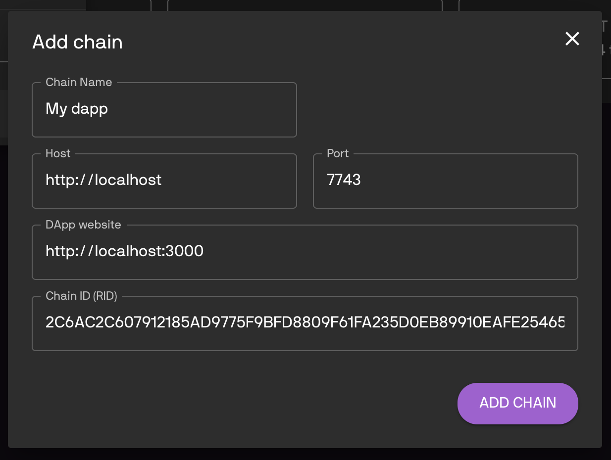

=================
Project Setup
=================

In this section, we explain how to setup a project to use FT3.

First let's clone FT3's bootstrap project repository:

.. code-block:: text

  git clone https://bitbucket.org/chromawallet/develop-chromia.git

Create a new directory for your project, and copy the ``postchain`` and ``rell`` directories over to your project. The remaining ``client`` contains an example for Single Sign-On feature, so we will come back to it later.

Blockchain side setup
---------------------

Config dapp description
~~~~~~~~~~~~~~~~~~~~~~~~~

1. Go to ``postchain/config/nodes/``, you will find a ``dev`` directory. This is our postchain config directory. You can rename it to whichever name matching your convention (e.g. ``prod`` or ``dapp_name``)

2. Inside ``dev`` directory, open the file ``blochains/app/config.template.xml``, and change the settings for your chain:

.. code-block:: xml

  <run wipe-db="true">
      <nodes>
          <config src="../../node-config.properties" add-signers="true" />
      </nodes>
      <chains>
          <chain name="YOUR_CHAIN_NAME" iid="0">
              <config height="0">
                  <app module="">
                    <args module="lib.ft3.core">
                        <arg key="my_blockchain_name"><string>YOUR_DAPP_NAME</string></arg>
                        <arg key="my_blockchain_website"><string>YOUR_DAPP_WEBSITE</string></arg>
                        <arg key="my_blockchain_description"><string>YOUR_DAPP_DESCRIPTION</string></arg>
                        <arg key="rate_limit_active"><int>1</int></arg> 
                        <arg key="rate_limit_max_points"><int>10</int></arg>
                        <arg key="rate_limit_recovery_time"><int>30000</int></arg>
                        <arg key="rate_limit_points_at_account_creation"><int>1</int></arg>
                    </args>
                  </app>
              </config>
          </chain>
      </chains>
  </run>

``my_blockchain_name``
  Name of your chain.

``my_blockchain_website``
  "Main page" url of your dapp.

``my_blockchain_description``
  Description of your dapp.

The following arguments is settings for the rate limiter (spam prevention). The client will accumulate one "operation point" every ``rate_limit_recovery_time`` milliseconds, up to ``rate_limit_max_points``. One point is spent for each operation.

``rate_limit_active``
  0 for not active (no spam prevention) or 1 to acticate the rate limit.

  Note that even if rate limiter is not active, you must set some values in the following args.

``rate_limit_max_points``
  Maximum amount of operation points that is possible to accumulate (and therefore the maximum number of transactions that can be made at once)

``rate_limit_recovery_time``
  (In milliseconds) period of cool down before an account can receive one operation point.

``rate_limit_points_at_account_creation``
  How many points an account have at the moment of creation (0 is min)

.. note::
  Please note that if you use Single Sign-On, an account need to perform 1 operation immediately at the moment of creation to add disposable ``auth_descriptor`` (eg. SSO need ``rate_limit_points_at_account_creation`` at minimum of 1). 
  
  Refer to the :doc:`SSO Section <./ft3-single-sign-on>` for more information.

Database setup
~~~~~~~~~~~~~~

We have provided a docker image of the database for ease of use:

.. code-block:: text

  cd postchain
  docker image pull chromaway/postgres:2.4.0-beta
  docker-compose up

.. note::

  If you don't want to use Docker, or want to setup your own database, please follow the instructions in :ref:`database-setup`.

  Update the ``postchain/config/nodes/dev/node-config.properties`` file to match your database settings.

Running the chain
~~~~~~~~~~~~~~~~~~

(From root directory) start your chain:

::

  ./postchain/bin/run-node.sh dev

Replace ``dev`` with the name of your postchain config directory if you have renamed it.

If everything is properly configured, you will soon see a success message printed to the console:

::

  Postchain node launching is done

Above that line you will find the generated blockchain ID of the blockchain that looks like this:

::

  INFO  2120-01-01 23:59:59.999 [main] BaseConfigurationDataStore - Creating initial configuration for chain 1 with BC RID: B61EFF348B43D7C93F67F6D2ABE17391D709A77F9A040D6309984665082DFE8A

Note down the blockchain ID, we will use it to connect to the chain.

.. important::

  Postchain will generate a blockchain ID for dapp based on the dapp's codebase.

  Whenever you change blockchain code of dapp, you will need to wipe database by adding the ``-W`` option, in order to get new blockchainID:

  ::

    postchain/bin/run-node.sh dapp_name -W

  If you missed the log in console, you can always check previous log in ``logs/logfile.log`` file.

Verify the chain is working
~~~~~~~~~~~~~~~~~~~~~~~~~~~

Go to the `Chain Explorer <https://explorer-testnet.chromia.com/>`_. Click the dropdown next to "Vault", then choose "add custom chain":

|Chain Explorer 1|

In the following popup, enter your chain's information, using information you entered in ``config.template.xml`` and the chain BRID:

|Chain Explorer 2|

If you see the chain's information displayed, then your chain is working properly:

|Chain Explorer 3|

If chain explorer can't connect to your chain, it indicates something is wrong with your settings from previous steps. Verify that the host and ports are correct (7743 is the default port from ``node-config.properties``), and also your blockchainID.

With that the blockchain side is ready, we can go on to the client side.

---------------

Client side setup
-----------------

The ``client`` directory you use in the bootstrap project is an example client, which will work with our current chain. In this section, we will discuss how to create our own client that connects to the chain.

Create a ``client`` directory for your project, run ``npm init`` (or bootstrap a project using a generator, e.g. ``create-react-app``).

Add dependencies to the nodejs project:

::

  npm i --save ft3-lib
  npm i --save postchain-client

Add other libraries to your liking.

Set config variables
~~~~~~~~~~~~~~~~~~~~

Choose your own method (e.g creating a config folder in your project and making a constants.js file in the config folder where you paste this into) to set these important config variables:

.. code-block:: js

  export const blockchainRID = "<YOUR CHAIN BRID>";
  export const blockchainUrl = "http://localhost:7743/"; // This is default value in node-config.properties file
  export const vaultUrl = "https://dev.vault.chromia-development.com"; // Vault's url for SSO

That concluded the project setup process. In next section, we will continue working with the client library and discuss the features of ``ft3-lib`` npm package.

.. From here, there are 2 paths to continue:

.. - If you like learning from example, head to the :doc:`Converting Chromia-Chat to FT3 <./ft3-chromia-chat>` section, where we will "upgrade" a previous Rell example project to use FT3.
.. - If you want to learn FT3 in detail, read :doc:`FT3 Javascript library <./ft3-javascript-library>` and :doc:`FT3-Rell Integration <./ft3-rell-ft3-integration>` sections.

.. |Chain Explorer 1| image:: ./chain-explorer-1.png

.. |Chain Explorer 3| image:: ./chain-explorer-3.png
