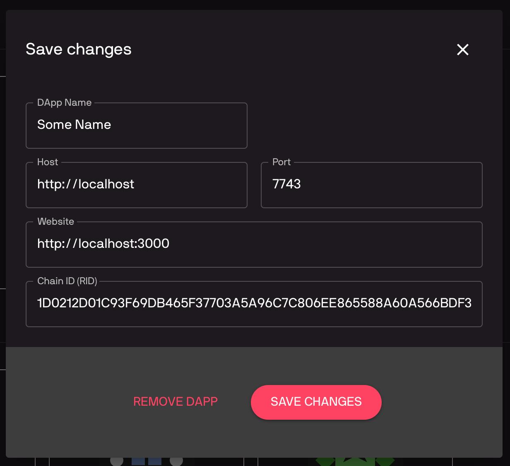

Single Sign-on (SSO)
====================

SSO allows user to login to different dapps with a single account. It is similar to how you can click a "Login with Facebook/Google" buttons to login to different services using a single Facebook/Google account.

In order for SSO to work, dapp must be integrated with a SSO service. :doc:`Chromia Vault <../chromia-vault>` is the main SSO service in Chromia ecosystem, though a custom SSO service can be easily implemented thanks to FT3 module's flexible authentication model.

As discussed in previous sections, access to a FT3 account is controlled with authentication descriptors (See :ref:`ft3-account-management`). So if we use a Vault account's public key to create an ``authDescriptor`` with ``'A'`` flag, and add it to a dapp account, Vault will have control over the dapp account.

The actual process is done in 3 steps:

 - User login to their Vault account, and approve of the SSO request.
 - Vault's keyPair is used to create a new account for dapp (so dapp account and Vault account will have the same accountId). A second ``authDescriptor`` with only ``'T'`` flag is created on-the-fly and added to this new dapp account.
 - The user can now use the second keyPair to perform transactions for the account.
 
This keyPair is meant to be disposable and can safely be discarded or replaced at user's discretion.

This might sound rather complicated to implement, but fortunately ``ft3-lib`` library already handle all of the heavy works, and dapps only have to config the SSO Class a bit for it to work.

The bootstrap project already contain a ``client`` directory that implement the SSO flow. Let's go through how to set up the flow using bootstrap client, then we will discuss how to config SSO flow for your own client.

SSO flow with bootstrap client
------------------------------

Backup your ``client`` directory somewhere safe, and replace it with the ``client`` directory from bootstrap project.

Set config variables
~~~~~~~~~~~~~~~~~~~~

Bootstrap client use ``dotenv`` npm package to set config variables. In ``client`` directory you can see a ``.env.sample`` file. Duplicate the file and rename it to ``.env``. Update the file with your chain's settings, besure to uncomment those lines (remove leading ``#``):

.. code-block:: text

  REACT_APP_VAULT_URL=https://vault-testnet.chromia.com
  REACT_APP_BLOCKCHAIN_RID=DAPP_BLOCKCHAIN_RID
  REACT_APP_NODE_ADDRESS=http://localhost:7743

Setup the dapp on Vault
~~~~~~~~~~~~~~~~~~~~~~~

Because our dapp is not public on Chain Explorer yet, we need to config it for testing as a Custom DApp.

Go to the `Vault page <https://vault-testnet.chromia.com>`_ and login to your account (Follow the instruction at :doc:`Chromia Vault <../chromia-vault>` section if you are unsure).

Scroll down to the "All DApps" section, and click "Add Custom DApp". Fill in information of your chain (similar to how you did with Chain Explorer during project setup).

|Vautl SSO|

You will see your dapp tile added to the Vault's dapp list.

Now the SSO flow is ready to use. Go back to your dapp (click the tile in Vault's dapp list), and you will see a login screen. Clicking the login button will redirect you to Vault to login to your Vault account.

If everything was setup correctly, Vault will ask you to authorize dapp. Clicking "Authorize" button will redirect you back to your client, with the newly created account's information displayed.

If the Authorize page is not displayed, it indicates a problem with your configs. Verify that the BRID and host is correct and try again.

--------

We got the bootstrap client to work with SSO. You can use the bootstrap client as a base to build your own client. But if you want to implement SSO in your own client, the next part discuss how to do exactly that.

SSO Class
---------

FT3 provides SSO functionality through SSO class. The first step in integrating SSO into a dapp is to initialize SSO class on the app launch:

.. code-block:: js

  import { Blockchain, SSO } from 'ft3-lib';
  import { blockchainRID, blockchainUrl, vaultUrl } from './configs/constants'; // these configs are set in project-setup section
  
  const chainId = Buffer.from(blockchainRID, 'hex');
  const blockchain = await new Postchain(blockchainUrl).blockchain(chainId);

  SSO.vaultUrl = vaultUrl;
  const sso = new SSO(blockchain);

Initiate login
--------------

When user click the "Login with Vault" button, dapp should call ``initiateLogin``:

.. code-block:: js

  const { SSO } from 'ft3-lib';
  
  const successUrl = `${window.location.origin}/success`;
  const cancelUrl = `${window.location.origin}/cancel`;
  
  sso.initiateLogin(successUrl, cancelUrl);

``initiateLogin`` navigates a user to the Vault, where they have to select one of their accounts in order to create a new dapp account or login to existing dapp account. After the user logs in to their vault account and authorizes login or account creation, they will be redirected back to the dapp to finalize login.

 - ``successUrl``: where to redirect to after a successful login
 - ``cancelUrl``: where to redirect to when user cancels the login

Finalize login
--------------

If there were no errors, Vault will redirect the user to the location of ``successUrl``.

Vault will add query parameters containing raw transaction - which needs to be signed by the dapp and posted to the blockchain.

Singing and posting is handled by the ``finalizeLogin`` method:

.. code-block:: js

  import { parse } from 'query-string';
  
  const { rawTx } = parse(search); // extract rawTx query parameter
  
  try {
    const [account, user] = await sso.finalizeLogin(rawTx);
  } catch (error) {
    // handle error
  }
 

``finalizeLogin`` returns a tuple which contains ft3 ``account`` (``Account`` instance) and ft3 ``user`` (``User`` instance).

If an account doesn’t already exist, call to ``finalizeLogin`` will create it, and if it was already created, only auth descriptor would be added to the account. Returned user object contains a key pair used to sign the transactions and an auth descriptor to authorize operations.

This same flow is used both for registering new dapp account and login to existing account.

Auto-login (Remember Me)
--------------------------

By default, SSO uses an instance of ``SSOStoreDefault`` to keep track of account (account id) and user (key pair) details in memory. As soon as SSO instance is destroyed (e.g. page refresh), account and user details are lost.

But it is also possible to persist them to local storage. Details will be stored to local storage if SSO is initialized with ``SSOStoreLocalStorage``:

.. code-block:: js

  import { SSO, SSOStoreLocalStorage } from 'ft3-lib';
  
  const sso = new SSO(blockchain, new SSOStoreLocalStorage());
 

On app launch, the auto-login feature can be used to auto login user if they have already logged in previously:

.. code-block:: js

  const [account, user] = await sso.autoLogin();

  if (account === null) {
    // redirect to login page
  }

Like ``finalizeLogin`` method, ``autoLogin`` returns ``account`` and ``user`` objects.

Auto login will only work if SSO can find account id and keypair in LocalStorage, and if the ``authDescriptor`` which corresponds to stored key pair didn't expire.

If ``autoLogin`` returns ``null`` for ``account`` and ``user``, then user should be redirected to a normal login page, where ``initiateLogin`` should be called to login using the Vault.

.. warning::

  Storing the key pair inside LocalStorage is potentially a security risk, therefore ``SSOStoreLocalStorage`` should only be used if dapp doesn't require a high level of security.

  In high security cases, dapp should implement its own method of preserving ``user.keyPair`` for future use.

Logout
------

Call ``logout`` method to delete local cache and auth descriptor:

.. code-block:: js

  await sso.logout();

.. note::

  Make sure you are using the same SSO instance which was used when calling ``finalizeLogin``, because account and user details are stored in that object instance.

Low level details
----------------------

As briefed in the beginning, SSO flow creates an ft3 account on a dapp's chain which has the same accountId as the user’s Vault account. 

In the flow, Vault is responsible for building a transaction which creates the account and adds an authDescriptor to it. Once Vault passes the transaction to the dapp (via request parameters), dapp signs it and posts it to the blockchain by calling ``finalizeLogin``.

This transaction will perform 2 operations, which add two auth descriptors to the account. One is added with a call to ``register_account`` operation and second is added with ``add_auth_descriptor`` operation.

- First ``authDescriptor`` is created using Vault public key and has ``'A'`` and ``'T'`` flags
- The second is created using a disposable public key (generated by ``initializeLogin`` method) with only “T” flag.

If an account with the same accountId as Vault's account already exists on the blockchain, SSO will only add the second ``authDescriptor`` with disposable public key.

.. important::

  Because the new account need to add the disposable auth descriptor immediately at creation time, it is required that you set a value equal or greater than 1 for ``rate_limit_points_at_account_creation`` in ``config.template.xml`` as we have noted during :doc:`Project Setup <./ft3-project-setup>`.

  If you also need to record additional user information (as discussed below), the minimum value will need to be increased further.

Dapp Account when using SSO
----------------------------

SSO can only create a ft3 account, but in most cases that is not enough to store dapp account details.

Using the same example ``dapp_account`` entity in :doc:`Rell Integration <./ft3-rell-ft3-integration>`:

.. code-block:: rell

  entity dapp_account {
    key account: ft3.account;
    key username: text;
  }

We can make some changes to support the SSO flow:

.. code-block:: rell

  operation create_dapp_account(
      username: text, 
      account_id: byte_array, 
      auth_descriptor_id: byte_array
  ) {
    val account = auth_and_log(
      account_id, 
      auth_descriptor_id, 
      list<text>()
    );
  
    create dapp_account (account, username);
  }
  
  query get_dapp_account(account_id: byte_array) {
    return dapp_account @? { .account.id == account_id } (
      account_id = .account.id,
      username = .username
    );
  }

And then on the client side the login flow would look like this:

.. code-block:: js

  const [account, user] = await blokchain.finalizeLogin(tx);
  
  const dapp_account = await blockchain.query(
    'get_dapp_account',
    { account_id: account.id }
  );

  const username = 'john_doe'; // Fake username
  
  if (!dapp_account) {
    await blockchain.call(
      op('create_dapp_account', username, account.id, user.authDescriptor.id), 
      user
    );
  }

On the login success page, we check if the dapp account exists by calling ``get_user`` query. If ``null`` is returned, that means the account doesn't exist yet, so we have to create it.

In this oversimplified example, it is done by calling ``create_user`` operation with hard-coded info. In a real dapp, we would need a form where user can enter those account details.

Next time the user logs in, ``get_user`` query will return the dapp account, so the dapp account creations step will be skipped.

