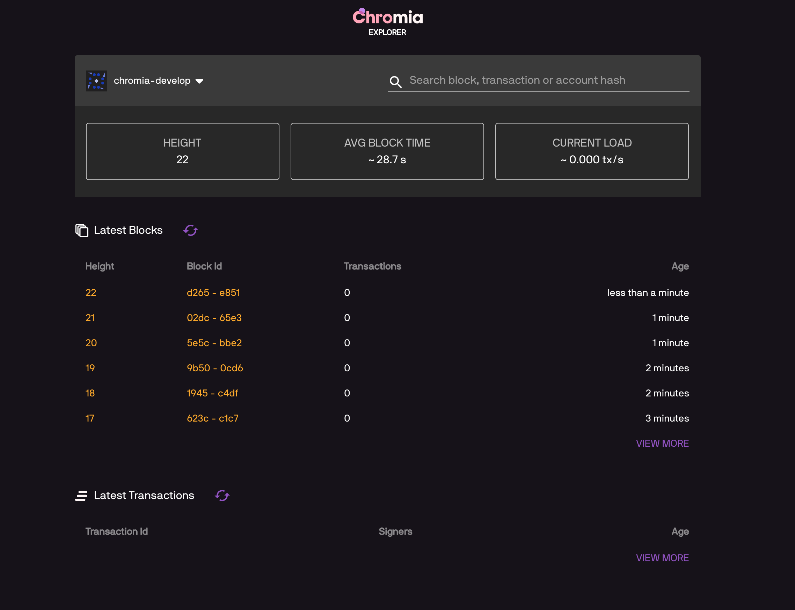

How to update a dapp chain
==========================

Dapps evolve over time. And in this section, we discuss what to do in order to seamlessly update a dapp's chain to new version.

There are 2 approaches to update a chain:

- Specify different config entry points for old and new versions, or
- Reference compiled configuration of old version

Project structure before update
----------------------------------

For both approaches, we will use an example project with a basic ft3 structure.

We have all of our chain's code within ``rell/src`` folder:

.. code-block:: text

  rell/src 
        ├── lib
        │   ├── ft3
        │   └── … (other optional libraries)
        └── module.rell

And our ``config.template.xml`` should look like the following:

.. code-block:: xml

  <run wipe-db="true">
      <nodes>
          <config src="../../node-config.properties" add-signers="true" />
      </nodes>
      <chains>
          <chain name="YOUR_CHAIN_NAME" iid="0">
              <config height="0">
                  <app module="">
                      <args module="lib.ft3.core">
                          <!-- ... (your chain configs) -->
                      </args>
                  </app>
              </config>
          </chain>
      </chains>
  </run>

.. contents::

-----

Update by specifying different entry points
-------------------------------------------

Use this approach when you want to have a clear overview of old version's code.

.. note::

  An example project to demonstrate this approach is available at branch ``example/update-chain-keep-old-code`` of ``develop-chromia``:

  .. code-block:: text

    git clone https://bitbucket.org/chromawallet/develop-chromia.git
    git checkout example/update-chain-keep-old-code

Restructure the code
~~~~~~~~~~~~~~~~~~~~

As mentioned ealier, the target of this approach is to have clear overview of old code after several updates. So it might be considered good procedure to create different entry module for each chain version.

We will name each module with the current version tag, so that it will be clear what has been run in the past. After that, we will update the ``config.template.xml`` file by adding each version configuration and the height at which the changes will become effective.

The rell structure will then look like:

.. code-block:: text

  rell/src 
        └── v0_0_1
            ├── lib
            │   ├── ft3
            │   └── … (other optional libraries)
            └── module.rell

So essentially we just created a folder ``v0_0_1`` inside ``src`` and moved the all the previous files there.

We will need to update the ``config.template.xml`` file to reflect this change. Note the change at ``<app>`` and ``<arg>`` tags:

.. code-block:: xml

  <run wipe-db="true">
      <nodes>
          <config src="../../node-config.properties" add-signers="true" />
      </nodes>
      <chains>
          <chain name="YOUR_CHAIN_NAME" iid="0">
              <config height="0">
                  <app module="v0_0_1">
                      <args module="v0_0_1.lib.ft3.core">
                          <!-- ... (your chain configs) -->
                      </args>
                  </app>
              </config>
          </chain>
      </chains>
  </run>

.. note::
  
  As a matter of information, the project's entry path is specified under postchain/config/nodes/dev/blockchains/app/entry-file.txt.

Confirm the new configuration is working properly by starting the chain:

.. code-block:: text

  ./postchain/bin/run-node.sh dev

Adding new codes
~~~~~~~~~~~~~~~~

Now that we have restructured the code, we can upgrade the code. To do that we copy ``v0_0_1`` folder and rename it ``v0_0_2``.

.. code-block:: text

  rell/src 
        ├── v0_0_1
        │   ├── lib
        │   │   ├── ft3
        │   │   └── … (other optional libraries)
        │   └── module.rell
        │
        └── v0_0_2
            ├── lib
            │   ├── ft3
            │   └── … (other optional libraries)
            └── module.rell

For easy testing, we can add one new query in the ``module.rell`` file of ``v0_0_2``:

::

  module;

  import lf: .lib.ft3.ft3_basic_dev;

  query get_version() {
    return "0.0.2";
  }

If everything works correctly we will not receive any response when running the module ``v0_0_1`` but we will receive ``0_0_2`` when running the module ``v0_0_2``.

Set the migration to new module
~~~~~~~~~~~~~~~~~~~~~~~~~~~~~~~

To migrate to the new module, we need to update the ``config.template.xml`` file.

We will add a new ``<config>`` tag inside our ``<chain>``, and set it to be enabled at a certain (block) ``height``:

.. code-block:: xml

  <run wipe-db="true">
      <nodes>
          <config src="../../node-config.properties" add-signers="true" />
      </nodes>
      <chains>
          <chain name="YOUR_CHAIN_NAME" iid="0">
              <config height="0">
                  <app module="v0_0_1">
                      <args module="v0_0_1.lib.ft3.core">
                          <!-- ... (your chain configs) -->
                      </args>
                  </app>
              </config>
              <config height="20">
                  <app module="v0_0_2">
                      <args module="v0_0_2.lib.ft3.core">
                          <!-- ... (your chain configs) -->
                      </args>
                  </app>
              </config>
          </chain>
      </chains>
  </run>

In this example, after 20 blocks the chain will change app module to ``v0_0_2``.

.. important::

  Ensure that the block height for the new configuration is safely higher than current height.
  
  Setting a block height that is lower than current height might cause problems to nodes that want to sync by re-applying all the transactions.

Test the chain
~~~~~~~~~~~~~~

Start our chain with

.. code-block:: text

  ./postchain/bin/run-node.sh dev

Recall the new query ``get_version()`` we created earlier. We can test the chain's version with a simple script such as:

.. code-block:: js

  const pcl = require('postchain-client');
  const node_api_url = "http://localhost:YOUR_NODE_PORT";

  // default blockchain identifier used for testing 
  const blockchainRID = YOUR_NODE_BRID;

  const rest = pcl.restClient.createRestClient(node_api_url, blockchainRID, 5);
  const gtvHash = pcl.gtv.gtvHash;

  const gtx = pcl.gtxClient.createClient(
      rest,
      Buffer.from(blockchainRID, 'hex'),
      [] );

  const gtv = pcl.gtv;
  const gtxU = pcl.gtx;

  ( async () => {
    try {
      const version =  await gtx.query("get_version", {});
    } catch (e) {
      console.log("New version not yet implemented");
    } finally {
      if(version) {
        console.log(`New version running: ${version}`)
      }
    }

  })();

We can monitor the blockchain by linking it to the `Explorer <https://explorer-testnet.chromia.com/>`_ :

|Update A Chain|

At block 20 we will start getting a result back from the chain. It will return something like:

.. code-block:: text

  POST URL http://localhost:7743/query/A54320E7D063AB94513467806FE800A1B95B26BF65C4F11D30C5D65859E4025C

  0.0.2

-------

Update by referencing old configuration
---------------------------------------------

The second approach that can be used is to specify previous compiled configurations in the config tag.

Use this approach if you want cleaner code structure.

.. note::

  An example project to demonstrate this approach is available at branch ``feature/CCD210-update-chain-tutorial`` of ``develop-chromia``:

  .. code-block:: text

    git clone https://bitbucket.org/chromawallet/develop-chromia.git
    git checkout feature/CCD210-update-chain-tutorial

What does run-node.sh do?
~~~~~~~~~~~~~~~~~~~~~~~~~~~

In order to discuss this approach, we must first explain what happened when you execute ``./postchain/bin/run-node.sh dev`` in the console.

This command does 3 things.

1. First it creates a target folder where the compiled blockchain configuration will be placed, something like:

.. code-block:: text

  mkdir -p ./postchain/runtime/nodes/dev 

2. Then it generates the blockchain configuration by compiling the rell code with the ``config.template.xml`` file.

If it is a new chain (e.g. started with the ``-W`` option), the BRID is also generated at this step. Since we are dicussing updating a chain here, we don't want the BRID to change, so ``-W`` option should never be called while updating.
  
.. code-block:: text

  ./postchain/lib/multigen.sh ./postchain/config/nodes/dev/blockchains/app/config.template.xml -d ./rell/src -o ./postchain/runtime/nodes/dev/

It should create the following architecture inside ``postchain/runtime/nodes/dev``:

.. code-block:: text

  postchain/runtime/nodes/dev
  ├── blockchains
  │   └── 0
  │       ├── 0.gtv (creates a one file rell module)
  │       ├── 0.xml (creates the configuration that will be run, also by using the just created 0.gtv)
  │       └── brid.txt (just a file where is output the brid of the chain, n.b. it will remain constant nevertheless the updates)
  │
  ├── node-config.properties
  └── private.properties
        
3. Finally, it runs the new configuration with

.. code-block:: text

  ./postchain/lib/postchain.sh run-node-auto -d ./postchain/runtime/nodes/dev

Backup old configuration
~~~~~~~~~~~~~~~~~~~~~~~~

Compile the current code (by executing ``./postchain/bin/run-node.sh dev`` or only step 1 and 2 described above).

In the generated configuration folder, copy ``runtime/nodes/dev/0.xml`` into ``postchain/config/nodes/dev/blockchains/app``, and rename it ``0.0.1.xml``

Adding new codes
~~~~~~~~~~~~~~~~

In the previous approach, we were keeping track from a code point of view of previous versions. This time we will not do that, so we can change the current code directly without copying anything.

Let's just add the query into the ``module.rell`` file:

::

  module;

  import lf: .lib.ft3.ft3_basic_dev;

  query get_version() {
    return "0.0.2";
  }

Set the migration to new module
~~~~~~~~~~~~~~~~~~~~~~~~~~~~~~~

Update the ``config.template.xml`` file to config the migration.

Note that unlike the other approach, this time we don't have to change the ``<app>`` and ``<args>`` tags:

.. code-block:: xml

  <run wipe-db="true">
      <nodes>
          <config src="../../node-config.properties" add-signers="true" />
      </nodes>
      <chains>
          <chain name="YOUR_CHAIN_NAME" iid="0">
              <config height="0">
                  <gtv src="0.0.1.xml"/>
              </config>
              <config height="20">
                  <app module="">
                      <args module="lib.ft3.core">
                          <!-- ... (your chain configs) -->
                      </args>
                  </app>
              </config>
          </chain>
      </chains>
  </run>

.. important::

  Ensure that the block height for the new configuration is safely higher than current height.
  
  Setting a block height that is lower than current height might cause problems to nodes that want to sync by re-applying all the transactions.

Compile the new configuration and start the chain:

.. code-block:: text

  ./postchain/bin/run-node.sh dev

We can now `Test the chain`_ as before. If we try to query for ``get_version()`` after block 20 we will see ``0.0.2``.

